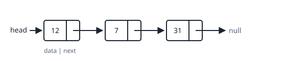

# Arrays

Advantages:
- fast access to any element by index
- efficient use of cache memory due to contiguous storage

Disadvantages:
- Fixed size
- insertion or deletion can be slow
- wasted memory if not fully utilized or needs to be copied to a larger array.

# Linked Lists



## Singly Linked Lists

### Traversal

- Create variable `current`
- traverse `current` through the linked list.

```python
current = head
while current is not None:
    print(current.data)
    current = current.next
```

### Insertion

- [ ] finish insertion notes

> [!QUESTION]- Why is access by index $O(n)$ in a linked list but $O(1)$ in an array?
> An array's elements sit next to each other, so the address of element $i$ is `start + i * size`. A linked list has to follow `next` pointers from the head, one node at a time.

The files below this note (`linked_list.py`, `timing.py`) have runnable code. `timing.py` imports `linked_list.py` to compare insertion speed.

```python
from linked_list import LinkedList
LinkedList([12, 7, 31])
```

See also [[Getting started]].
