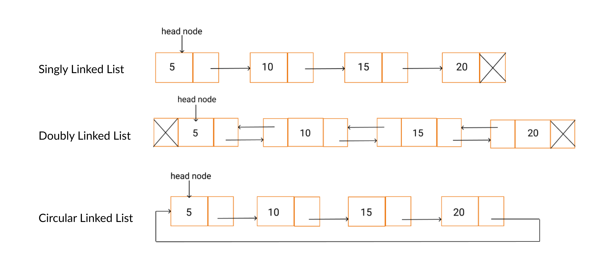

# Arrays:


Advantages:
- fast access to any element by index
- efficient use of cache memory due to contiguous storage
Disadvantages:
- Fixed size
- insertion or deletion can be slow
- wasted memory if not fully utilized or needs to be copied to a larger array. 


# Linked Lists: 




## Singly Linked Lists


### Traversion

- Create variable current
- traverse current through linked list.

### Insertion

Create Node

link 25 to 30
link rest to each

```python

class Node
    def _init_(self, data):
        self.data = data
        self.next = None
new_node = Node(25)
head = Node(5)
second = Node(10)
third = Node(15)
fourth = Node(30)
head.next = second
second.next = third
third.next = fourth
fourth.next = None

Current = head
while (Current != None) and (Current.data != 15):

if Current is not None:
    new_node.next = Current.next
    Current.next = new_node.next

```
