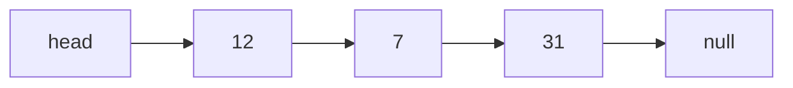

Every `.md` file in the `notes/` folder becomes a page. Folders are optional, but a note's first folder becomes its topic if you don't set one.

## Writing in the browser

Select **New note** in the sidebar (or **Edit** on any note). The editor has a formatting toolbar, live preview, and keyboard shortcuts (Ctrl+B, Ctrl+I, Ctrl+K and so on). Paste or drop screenshots straight into the text. Drafts save in your browser automatically, so closing the tab loses nothing.

Under the text, **Files** holds code and data that belong to the note: write Python or JavaScript and run it right there, or upload a CSV and read it from Python. When you're done, **Finish note** asks for the date, topics and tags, then either downloads everything as one zip or, in Chrome and Edge, saves it straight into your repo folder. Commit and push to publish.

## Code files

A note's files live in `assets/<note file name>/` next to it, alongside its images. They share the note's date, topics and tags, their contents are searchable, and they appear under **Code** in the sidebar filters (try `lang:python` in search). Python and JavaScript files and code blocks get a **Run** button; Python runs in the browser with Pyodide, including numpy, pandas and matplotlib.

## The note header

Put this at the very top of a note. Every line is optional.

```yaml
---
title: Arrays and linked lists   # default: the file name
date: 2026-09-24                 # default: date in the file name, then first git commit
topics: [Data structures]        # default: the folder name
tags: [arrays, complexity]
description: One line shown in lists.
draft: true                      # hides the note from the site
---
```

In VS Code, type `note` and pick the snippet to insert this.

## Linking notes

Write `[[Arrays and linked lists]]` to link by title: [[Arrays and linked lists]]. Use `[[Arrays and linked lists|a label]]` for different link text. Normal relative links such as `[text](data-structures/arrays-and-linked-lists.md)` also work. Linked notes show a "Linked from" list at the bottom.

## Callouts

> [!TIP]
> Start a quote with `[!TIP]`, `[!NOTE]`, `[!WARNING]`, `[!DEFINITION]`, `[!EXAMPLE]` or `[!IMPORTANT]`.

> [!DEFINITION] Big O notation
> Describes how running time grows with input size $n$, ignoring constants.

> [!QUESTION]- Add a minus sign to hide the body. Click to reveal.
> Useful for self-testing: put the question in the title and the answer in the body.

## Maths

Inline with single dollars: $T(n) = 2T(n/2) + O(n)$. Display with double dollars:

$$
\sum_{i=1}^{n} i = \frac{n(n+1)}{2}
$$

## Diagrams



## Tables and tasks

| Operation        | Array | Linked list |
|------------------|-------|-------------|
| Access by index  | O(1)  | O(n)        |
| Insert at front  | O(n)  | O(1)        |

- [x] Push a note
- [ ] Write the next one

## Images

Paste an image into a note in the browser editor or in VS Code. With the included settings it is saved to `assets/<note name>/` next to the note, and the link just works here. Click any image to enlarge it.

## Search

Press <kbd>/</kbd> anywhere to search. `tag:arrays` and `topic:data` narrow by tag or topic; matches are highlighted when you open a note.
