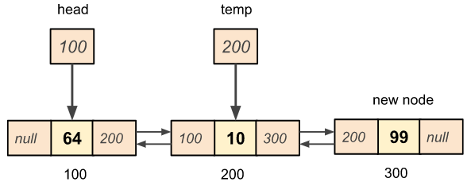
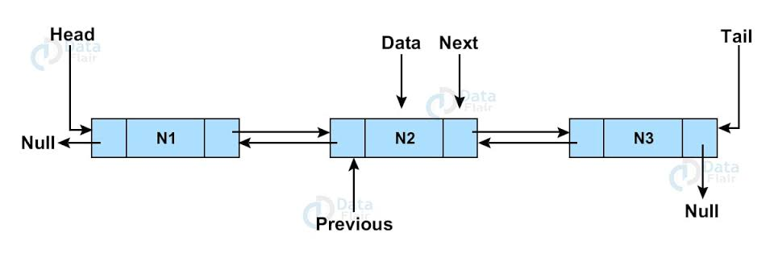

| Feature | Arrays | Linked Lists
|----------|-----------|----------|
|    Memory allocation      |     Contiguous block of memory     |   non-contiguous with pointers       |
|    Insertion/Deletion      |   inefficient for middle insertions/deletions       |   efficient, especially in the middle       |
|   Access time       |   Constant time (O(1))       |       Proportional to position (O(n))   |
|          |          |          |
|          |          |          |
|          |          |          |

- Links in both ways

Time complexity
| operation | array | linked list
|-----|-----|-----|
|accessing the nth element| O(1) | O(n) |
|Inserting an element | O(n)| O(1) |
|Removing an element | O(n)| O(1) |

## Insertion

- Create the new node
- Find the node before and the node after the insertion point
- new node next points to node after
- node after's prev points to new node
- new node prev points to node before
- node before's next points to new node

## Deletion
- find node to be deleted
- node before + node after
- Before's next node points to node after
- after's prev node points to node before
- delete node

deleting the head: update head first
deleting the tail: update tail first
