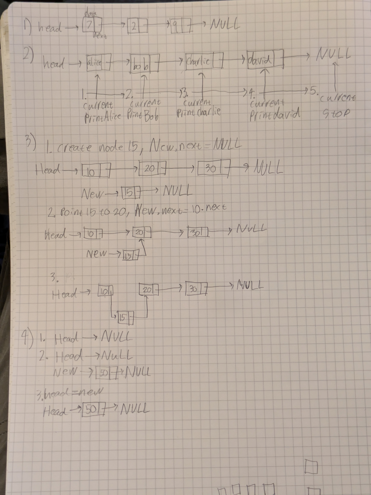
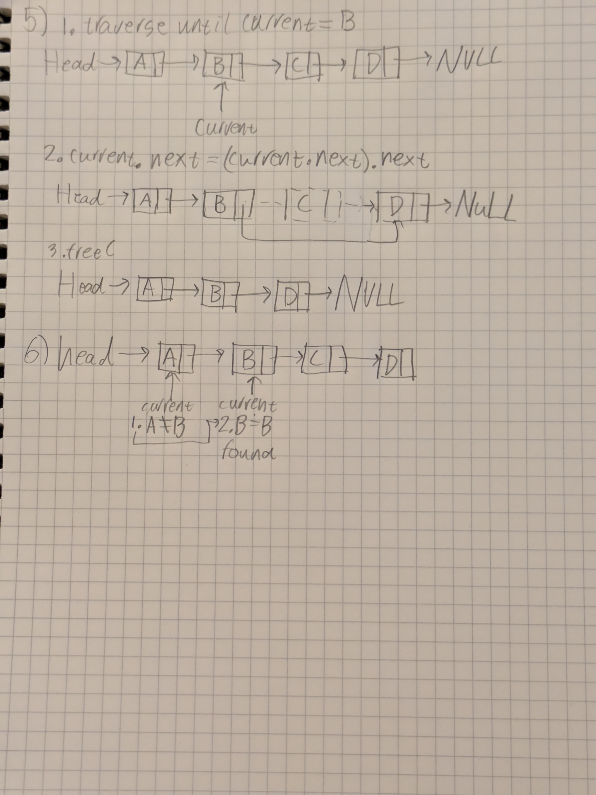

## Diagrams





### 6. 

The steps of the search are:

- Step 1: Current = Head, so it points to A. A is checked; it isn't B, so Current = Current.next.
- Step 2: Current points to B. B is checked; it matches, so the search returns "found" and stops.

With no value in the list, Current would eventually reach NULL and the search would return "not found."

### 7. 

An advantage of a singly linked list is that its size is dynamic. It grows and shrinks. Inserting or deleting at a known position only means changing a pointer or two, as in Questions 3 and 5. An array would have to shift every later element, and might need resizing.

A disadvantage is that there is no random access. To reach the nth element you must traverse from Head whereas an array can index directly. Each node also uses extra memory to store its next pointer.

## coding activity

Create the `LinkedList` and `ListNode` classes, plan a test table, then run the tests.

## Code

```python
class ListNode:
    def __init__(self, data=0):
        self.data = data
        self.next = None


class LinkedList:
    def __init__(self):
        self.head = None

    def print_list(self):
        current = self.head
        while current != None:
            print(current.data, end=" -> ")
            current = current.next
        print("None")

    def insert_at_beginning(self, data):
        new_node = ListNode(data)
        new_node.next = self.head
        self.head = new_node

    def insert_after_value(self, target_value, data):
        current = self.head
        while current is not None:
            if current.data == target_value:
                new_node = ListNode(data)
                new_node.next = current.next
                current.next = new_node
                return
            current = current.next
        print(f"Node with data {target_value} not found.")

    def insert_at_end(self, data):
        new_node = ListNode(data)
        if self.head is None:
            self.head = new_node
            return
        current = self.head
        while current.next != None:
            current = current.next
        current.next = new_node

    def delete_node(self, data):
        current = self.head
        prev = None
        if current != None and current.data == data:
            self.head = current.next
            return
        while current != None and current.data != data:
            prev = current
            current = current.next
        if current == None:
            print(f"Node with data {data} not found.")
            return
        prev.next = current.next

    def search(self, key):
        current = self.head
        while current != None:
            if current.data == key:
                return True
            current = current.next
        return False
```
